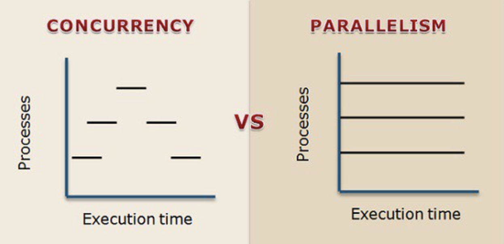

# Golang 101

## [Recap] Goroutines

- A goroutine is an independently executing function, launched by a `go` statement.
- It has its own call stack, which grows and shrinks as required.
- It's not a thread (執行緒).

**Demo Time** :alarm_clock:

[goroutine-1](https://github.com/wendyleeyuhuei/golang-101/tree/main/goroutine-1)

[goroutine-2](https://github.com/wendyleeyuhuei/golang-101/tree/main/goroutine-2)

[goroutine-3](https://github.com/wendyleeyuhuei/golang-101/tree/main/goroutine-3)

- What's missing?
  - The main function couldn't see the output from the other goroutine.
  - No communication at all.

## Go Channel

### Definition


- Provides a **connection** between two goroutines, allowing them to communicate. 
- **Bidirectional** as default. Goroutines can send/receive data through the same channel. 
  - Can be single-directional i.e. send-only or receive-only channel 
- **First-class values**, just like strings or integers. 
- A channel can only transfer values of the **same type**.

### Declaration & Initialization (宣告與初始化)

```
// Declaring and initializing.
var c chan int
c = make(chan int)
// or
c := make(chan int)
```

```
// Sending on a channel.
c <- 1
```

```
// Receiving from a channel.
// The "arrow" indicates the direction of data flow.
value = <-c
```

### Categories

- Buffered Channel (緩衝信道)
  - Has a buffer size.
  - Acts as a [semaphore](https://www.keil.com/pack/doc/CMSIS/RTOS/html/group__CMSIS__RTOS__SemaphoreMgmt.html#details); manage and protect access to shared resources.
  - Limits the throughput; the capacity of the channel buffer limits the number of simultaneous calls to process.
- Unbuffered Channel
  - Buffer size is set to zero.
  - Combines communication with synchronization.

### Sender & Receiver

- Receivers always block until there is data to receive.
- For unbuffered channel, the sender blocks until the receiver has **received** the value.
- For buffered channel, the sender blocks only until the value has been **copied** to the buffer. If the buffer is full, the sender needs to wait until some receiver has retrieved a value.

**Demo Time** :alarm_clock:

[channel-1](https://github.com/wendyleeyuhuei/golang-101/tree/main/channel-1): Channels both communicate and synchronize.

### Concurrency v.s. Parallelism (並行與平行)



- Concurrency
  - Composition of independently executing processes.
  - Make use of **context switching**.
  - Increased amount of work accomplished at a time.
- Parallelism
  - Simultaneous execution of (possibly related) computations.
  - Make use of **multiple CPUs** for operating multiple processes.
  - Improved throughput, computational speed-up.

**Demo Time** :alarm_clock:

[channel-2](https://github.com/wendyleeyuhuei/golang-101/tree/main/channel-2): Function that returns a channel which lets us communicate with the service it provides.

[channel-3](https://github.com/wendyleeyuhuei/golang-101/tree/main/channel-3): Use fan-in function to let whosoever is ready talk.


[channel-4](https://github.com/wendyleeyuhuei/golang-101/tree/main/channel-4): Restoring sequence.

[channel-5](https://github.com/wendyleeyuhuei/golang-101/tree/main/channel-5): Refactor fan-in function.

## References

- [Effective Go - The Go Programming Language](https://go.dev/doc/effective_go#channels)
- [Concurrency is not parallelism - The Go Programming Language](https://go.dev/blog/waza-talk)
- [Channel in Golang - GeeksforGeeks](https://www.geeksforgeeks.org/channel-in-golang/)
- [Channels in Go](https://go101.org/article/channel.html)
- [Difference Between Concurrency and Parallelism (with Comparison Chart)](https://techdifferences.com/difference-between-concurrency-and-parallelism.html)
- [程序(進程)、執行緒(線程)、協程，傻傻分得清楚！](https://oldmo860617.medium.com/%E9%80%B2%E7%A8%8B-%E7%B7%9A%E7%A8%8B-%E5%8D%94%E7%A8%8B-%E5%82%BB%E5%82%BB%E5%88%86%E5%BE%97%E6%B8%85%E6%A5%9A-a09b95bd68dd)
