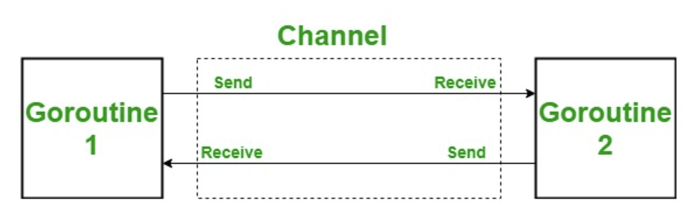
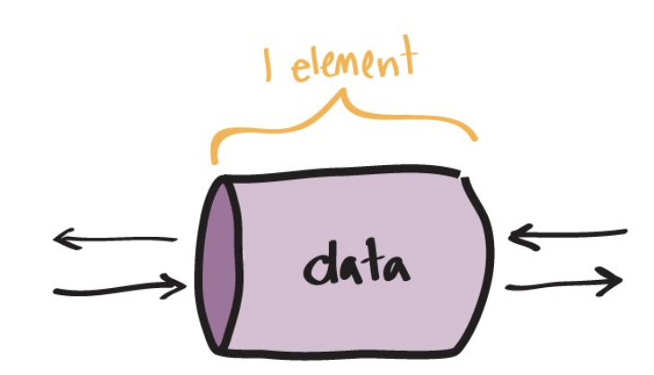
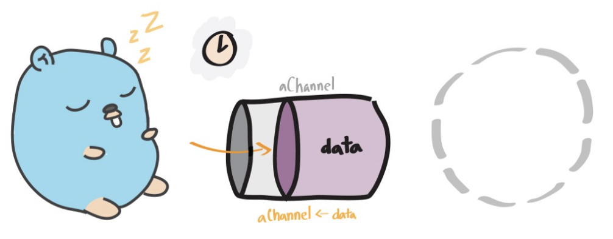
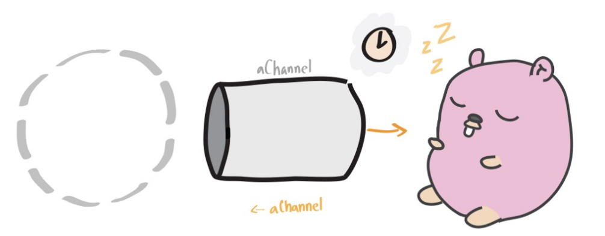
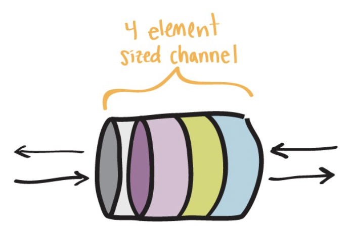
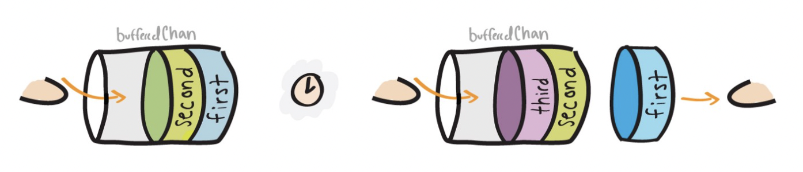
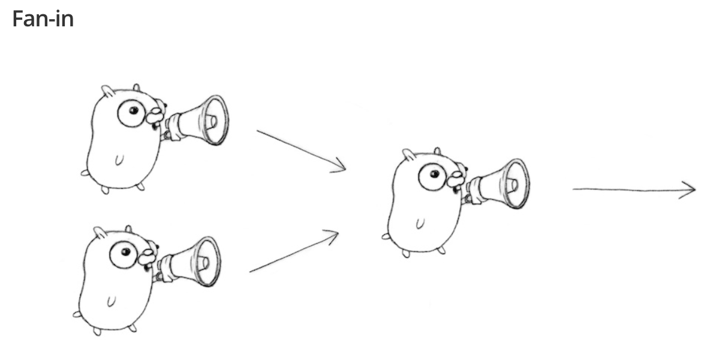

# Golang 101

## [Recap] Goroutines

- A goroutine is an independently executing function, launched by a `go` statement.
- It has its own call stack, which grows and shrinks as required.
- It's not a thread.

**Demo Time** :alarm_clock:

- [goroutine-1](https://github.com/wendyleeyuhuei/golang-101/tree/main/goroutine-1)

> Issues:
> 1. The main function couldn't see the output from the other goroutine.
> 2. No communication at all.

## Go Channel

### Definition



- Provides a **connection** between two goroutines, allowing them to communicate. 
- **Bidirectional** as default. Goroutines can send/receive data through the same channel. 
  - Can be single-directional i.e. send-only or receive-only channel 
- **First-class values**, just like strings or integers. 
  - First-class citizen can be used as function parameter/return type
- A channel can only transfer values of the **same type**.

### Declaration & Initialization

```
// Declaring and initializing.
var c chan int
c = make(chan int)
// or
c := make(chan int)
```

```
// Sending on a channel.
c <- 1
```

```
// Receiving from a channel.
// The "arrow" indicates the direction of data flow.
value = <-c
```

### Channel Blocking

**Unbuffered Channel**
- Buffer size is set to zero (only one piece of data fits through the channel at a time).
  
- The sender blocks until the receiver has **received** the value.
  
- The receiver blocks until there is data to receive.
  
- Combines communication with synchronization.

**Buffered Channel** 
- Has a buffer size (can send multiple pieces of data to the channel before needing another goroutine to read from it).
  
- The sender blocks only until the value has been **copied** to the buffer. If the buffer is full, the sender needs to wait until some receiver has retrieved a value.
  
- The receiver blocks until there is data to receive.
- Acts as a [semaphore](https://www.keil.com/pack/doc/CMSIS/RTOS/html/group__CMSIS__RTOS__SemaphoreMgmt.html#details) to limit the throughput
  - Semaphore manages and protects access to shared resources.
  - The capacity of the channel buffer limits the number of simultaneous calls to process.

**Demo Time** :alarm_clock:

- [channel-1](https://github.com/wendyleeyuhuei/golang-101/tree/main/channel-1): Create a channel that connects the main and boring goroutines so they can communicate.
  <pre>
  func main() {
    c := make(chan string)
    <b>go boring("boring!", c)</b>
    for i := 0; i < 5; i++ {
        <b>fmt.Printf("You say: %q\n", <-c) // Receive expression is just a value.</b>
    }
    fmt.Println("You're boring; I'm leaving.")
  }
  </pre>
  <pre>
  func boring(msg string, c chan string) {
    for i := 0; ; i++ {
        <b>c <- fmt.Sprintf("%s %d", msg, i) // Expression to be sent can be any suitable value.</b>
        time.Sleep(time.Duration(rand.Intn(1e3)) * time.Millisecond)
    }
  }
  </pre>
- [channel-1-1](https://github.com/wendyleeyuhuei/golang-101/tree/main/channel-1-1): Modify `boring` function to return a channel which lets us communicate with the service it provides.
  <pre>
  // in main function...
  <b>joe := boring("Joe")
  ann := boring("Ann")</b>
  for i := 0; i < 5; i++ {
    fmt.Println(<-joe)
    fmt.Println(<-ann)
  }
  fmt.Println("You're boring; I'm leaving.")
  </pre>
  <pre>
  func boring(msg string) <-chan string { // Returns receive-only channel of strings.
    c := make(chan string)
    go func() { // We launch the goroutine from inside the function.
        for i := 0; ; i++ {
            <b>c <- fmt.Sprintf("%s %d", msg, i)</b>
            time.Sleep(time.Duration(rand.Intn(1e3)) * time.Millisecond)
        }
    }()
    <b>return c // Return the channel to the caller.</b>
  }
  </pre>
- [channel-1-2](https://github.com/wendyleeyuhuei/golang-101/tree/main/channel-1-2): Use fan-in function to let whosoever is ready talk.
  <pre>
  func fanIn(input1, input2 <-chan Message) <-chan Message {
    c := make(chan Message)
    go func() {
      for {
        c <- <-input1 // receive value from input1 and send value to c
      }
    }()
    go func() {
      for {
        c <- <-input2
      }
    }()
    return c
  }
  </pre>
  
- [channel-1-3](https://github.com/wendyleeyuhuei/golang-101/tree/main/channel-1-3): Restore sequence in the previous example.

### Select Control Structure

**Demo Time** :alarm_clock:

- [channel-1-4](https://github.com/wendyleeyuhuei/golang-101/tree/main/channel-1-4): Refactor fan-in function.
  <pre>
  func fanIn(input1, input2 <-chan Message) <-chan Message {
    c := make(chan Message)
    go func() {
      for {
        // Select the communication that is ready to proceed
        <b>select {
        case s := <-input1:
          c <- s
        case s := <-input2:
          c <- s
        }</b>
      }
    }()
    return c
  }
  </pre>
- [channel-2](https://github.com/wendyleeyuhuei/golang-101/tree/main/channel-2): Another example, we can timeout using `select`.
- [channel-2-1](https://github.com/wendyleeyuhuei/golang-101/tree/main/channel-2-1): Timeout for whole conversation using `select`.
- [channel-2-2](https://github.com/wendyleeyuhuei/golang-101/tree/main/channel-2-2): Pass a quit channel to the service provider and confirm its termination by receiving value from the quit channel.

### Concurrency v.s. Parallelism

([slide p.12](https://talks.golang.org/2012/waza.slide#12) ~ [slide p.23](https://talks.golang.org/2012/waza.slide#23))

- Concurrency: programming as the composition of independently executing processes (process in general).
- Parallelism: programming as the simultaneous execution of (possibly related) computations.
- Concurrency is about structure, parallelism is about execution.

**Demo Time** :alarm_clock:

**Google Search**
- [search-1](https://github.com/wendyleeyuhuei/golang-101/tree/main/search-1): Takes a query and returns a slice of Results.
- [search-2](https://github.com/wendyleeyuhuei/golang-101/tree/main/search-2): Run the Web, Image, and Video searches concurrently, and wait for all results.
- [search-2-1](https://github.com/wendyleeyuhuei/golang-101/tree/main/search-2-1): Implement with `select` statement.
- [search-3](https://github.com/wendyleeyuhuei/golang-101/tree/main/search-3): Reduce tail latency using replicated search servers.
  - Tail Latencies are things like: "my service mostly responds in around 10ms, but sometimes takes around 100ms"

**Load Balancer** ([slide p.45](https://talks.golang.org/2012/waza.slide#45))
- [load-balancer](https://github.com/wendyleeyuhuei/golang-101/tree/main/load-balancer)

## References

- [Effective Go - The Go Programming Language](https://go.dev/doc/effective_go#channels)
- [Concurrency is not parallelism - The Go Programming Language](https://go.dev/blog/waza-talk)
- [Channel in Golang - GeeksforGeeks](https://www.geeksforgeeks.org/channel-in-golang/)
- [Channels in Go](https://go101.org/article/channel.html)
- [Learning Go's Concurrency Through Illustrations | by Trevor Forrey | Medium](https://medium.com/@trevor4e/learning-gos-concurrency-through-illustrations-8c4aff603b3)
- [Difference Between Concurrency and Parallelism (with Comparison Chart)](https://techdifferences.com/difference-between-concurrency-and-parallelism.html)
- [What is a First-class Object?](https://www.computerhope.com/jargon/f/firstclass-object.htm)
- [Load balancer github code](https://gist.github.com/chenlujjj/f2cc6b75e5276e41bf82b5d561fcf28f)
